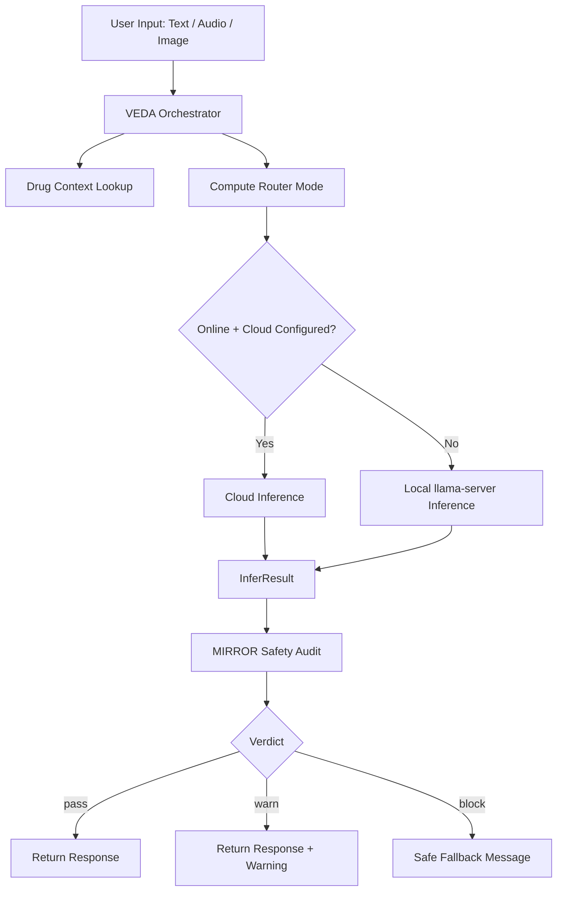

# AEGIS Information README

## 1) What We Are Building

AEGIS is an offline-first, safety-focused medical first-response assistant built for low-connectivity and time-critical situations.

It is designed to help a non-expert user get immediate, practical first-aid guidance from text, voice, and optional image input, while reducing harmful AI behavior through a second safety pass.

Core idea:
- Primary assistant generates first-aid guidance.
- MIRROR performs a safety audit on that guidance.
- Final answer is filtered by a safety verdict (`pass`, `warn`, `block`).

This is not a diagnosis system. It is a triage and first-response assistant.

## 2) Why We Are Building It

The project goal is to compete for first place in the Kaggle Gemma 4 Good Hackathon with a solution that is:
- Socially useful (real public-health need)
- Technically credible (works online and offline)
- Safety-aware (self-audit + constrained prompt behavior)
- Demonstrable (clear live demo flow with measurable metrics)

Win thesis:
- Many demos are impressive but fragile under weak connectivity.
- AEGIS focuses on practical reliability in real-world constraints (offline fallback, voice accessibility, drug context, safety gating).
- If we show strong eval metrics and a robust demo story, this can be a high-scoring submission.

## 3) Product Scope and Features (Current)

Implemented capabilities in current codebase:
- Online/offline routing via compute mode.
- Local inference path through local llama-server HTTP endpoints.
- Cloud inference path when configured, with automatic local fallback.
- Structured inference result object including latency (`InferResult`).
- Multimodal support (text + optional image).
- Drug cache enrichment and optional live OpenFDA lookup path.
- MIRROR safety audit parsing and verdict application.
- Voice pipeline:
  - Speech-to-text (`faster-whisper`)
  - Text-to-speech (`pyttsx3`)
  - Multi-turn session history
- Flask API surface for web and programmatic use.
- Browser frontend with text/voice interactions.
- Unit test coverage across core modules, app, voice, and routing behavior.

Recent high-impact backend improvements:
- Inference now returns latency and metadata instead of discarding timing.
- Inference routing uses cached status lookup (`get_status`) rather than forcing refresh on every request.
- Local model health checks are cached for 60 seconds to avoid repeated internal health pings from status polling.

## 4) Architecture Overview

### 4.1 High-level components

- `app.py`:
  - HTTP API routes (`/status`, `/veda`, `/voice`, etc.)
  - Upload handling and response shaping

- `core/compute_router.py`:
  - Online/offline mode state
  - Connectivity and memory signals

- `core/gemmaa_core.py`:
  - Cloud and local inference adapters
  - Unified `infer()` that returns `InferResult`
  - Model info and cached local-health checks

- `core/mirror.py`:
  - Safety audit prompt and parser
  - `MirrorReport` + final verdict application

- `modules/veda.py`:
  - Orchestrates the full pipeline (input -> context -> infer -> audit -> final)

- `modules/drug_lookup.py`:
  - Cache-first medication enrichment

- `modules/voice_utils.py` and `modules/voice_handler.py`:
  - STT/TTS and conversational session handling

### 4.2 Request flow

### 4.3 API-oriented architecture characteristics

- Thin route layer, orchestration in modules, model adapters in core.
- Safe fallback behavior in multiple stages (cloud->local, parser fallback, system fallback).
- Latency surfaced via `processing_time_ms` for benchmarking and demo telemetry.

## 5) Why This Idea Can Be Competitive

Judges usually reward a combination of impact, technical depth, reliability, and demo quality.

AEGIS has strong foundations in:
- Real impact category (health first-response)
- Reliability story (online/offline behavior)
- Safety story (MIRROR second-pass audit)
- Accessibility story (voice IO + simple language)

To reach first-prize level, we must add stronger measurable evidence (see sections 7 and 8).

## 6) Reality-Truth Comparison: Gemma 3n Winner Patterns vs AEGIS

Important truth statement:
- We are not claiming specific private judging data or unpublished winner internals.
- The comparison below is reality-grounded against common patterns observed in strong Gemma-era hackathon winners: clear user value, polished demo, measurable evaluation, and deployment readiness.

| Dimension | Common Pattern in Strong Gemma 3n-era Winners | AEGIS Current State (Truth) | Gap Level |
|---|---|---|---|
| Problem clarity | Very clear user + pain point | Strong: emergency first-response is clear and meaningful | Low |
| End-to-end UX | Smooth, demo-ready flow | Good: web + voice flow exists, but needs stronger product polish | Medium |
| Reliability under constraints | Works in adverse conditions | Good: offline fallback exists; router/cache behavior still needs hardening | Medium |
| Safety and trust | Explicit guardrails and disclaimers | Strong: MIRROR + verdict gating in place | Low |
| Measurable evaluation | Quantitative metrics and ablation | Partial: latency now exposed, but full benchmark/reporting is incomplete | High |
| Model quality evidence | Side-by-side quality benchmarks | Weak: no comprehensive benchmark report yet | High |
| Deployment readiness | Reproducible setup and stable runtime | Partial: local binary/runtime assumptions still fragile on some systems | Medium |
| Novelty/storytelling | Distinct framing + clear demo narrative | Good base story; needs tighter, memorable demo narrative | Medium |

Bottom line:
- AEGIS is directionally strong and practical.
- As of now, it looks like a credible finalist architecture, not yet a guaranteed first-place package.
- First-prize probability depends on closing evaluation, polish, and operational reliability gaps fast.

## 7) What Is Still Missing (Critical Focus)

### P0: Must-fix before final submission

- Complete benchmark pack:
  - Latency distributions (p50/p95)
  - Safety outcomes (`pass/warn/block`) across curated scenarios
  - Online vs offline quality and latency comparison
  - Failure-mode behavior and fallback success rates

- Robust router caching semantics:
  - Ensure status refresh cadence is bounded and intentional.
  - Avoid unnecessary network checks that inflate latency on mobile or unstable links.

- Medical safety validation set:
  - Build a scenario suite (burns, bleeding, chest pain, breathing distress, poisoning, pediatric fever, etc.).
  - Evaluate harmful advice suppression and escalation behavior.

- Demo resilience hardening:
  - Confirm local runtime dependencies and startup scripts are consistent on target machines.
  - Verify fallback behavior under cloud outage and airplane mode.

### P1: High-value improvements

- Better observability:
  - Structured request IDs
  - Trace logging for infer mode, fallback path, and audit outcome

- UI polish for judges:
  - Explicit mode badge (online/offline)
  - Confidence/risk panel from MIRROR output
  - Benchmark snapshot panel in the demo UI

- Security and privacy posture:
  - Clarify what data is stored, for how long, and how to disable retention.

### P2: Nice-to-have differentiators

- Multilingual prompt-quality tuning by locale.
- Lightweight follow-up question engine for safer triage.
- Optional clinician-facing explanation mode.

## 8) Concrete Execution Plan to Maximize Winning Odds

1. Freeze architecture and interfaces for submission stability.
2. Build and run benchmark suite with reproducible scripts.
3. Improve demo polish and reliability under offline stress tests.
4. Prepare a concise narrative deck:
   - Problem
   - Why Gemma 4
   - Architecture
   - Safety design
   - Quantitative results
   - Limitations and responsible-use statement
5. Record a clean, failure-tolerant demo video with mode switching and safety behavior visible.

## 9) Honest Positioning Statement for Submission

AEGIS should be presented as:
- A practical first-response assistant for constrained environments.
- A safety-aware architecture with explicit post-generation auditing.
- A system with strong baseline implementation and clear empirical validation work in progress.

Do not over-claim diagnostic capability.
Do claim reliability engineering, safety gating, and transparent limitations.

## 10) Final Summary

AEGIS already has the right backbone for a top-tier hackathon entry: meaningful impact, multimodal UX, online/offline architecture, and safety-first response filtering.

To turn this into a first-prize contender, the next sprint must focus on measurable evidence, runtime hardening, and judge-facing polish.

If we execute that final stretch with discipline, this project can be highly competitive.
